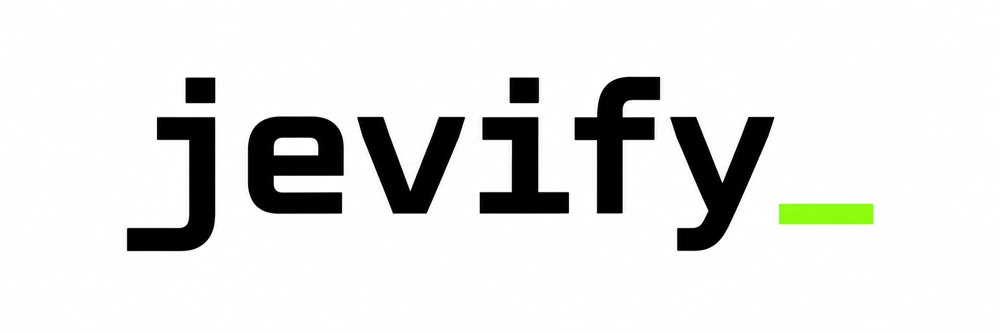
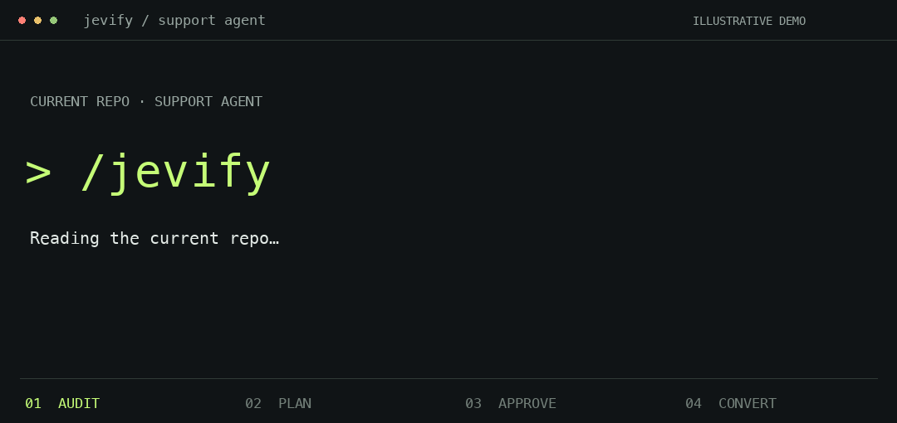
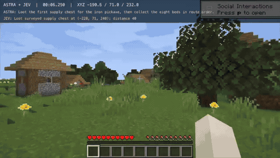

<div align="center">



### Get your agents running on Jev today

**[Explore Jevify ↗](https://jevify.soupz11.chatgpt.site/)** · [Install](#install) · [Docs](skills/jevify/INSTALL.md)

[](docs/demos/jevify-flow.md)

</div>

## Install

```sh
npx skills add Kevin-Zhouu/jevify
```

Then, in Claude Code (beta):

```text
/jevify
```

In Codex: `$jevify`. Or say **“jevify this repo.”** Optional: `/jevify src/agents/triage.py`.

See the audit first. Then choose a new branch, a separate copy, report only, or individual calls. No key or setup questions needed to see the plan.

*The animation illustrates the flow; its files, counts and test results are examples.* [Demo details](docs/demos/jevify-flow.md) · [Real historical run](docs/demos/jevify-session/README.md)

## LLM vs Jev for decisions

[](https://raw.githubusercontent.com/Kevin-Zhouu/jevify/main/docs/demos/claude-vs-jev.mp4)

**12 questions. 136 lines of JSON. Jev: 0.44s. Claude Haiku 4.5: 5.11s.**

All 12 category choices match. One synthetic example via OpenRouter, replayed from real stream timestamps—not a general benchmark. [Watch video](https://raw.githubusercontent.com/Kevin-Zhouu/jevify/main/docs/demos/claude-vs-jev.mp4) · [Raw data](docs/demos/README.md)

## How it works

**One command → Audit → You approve scope + output → Convert → Validate**

- **Your codebase:** finds call sites and traces how their outputs are used.
- **Your choice:** new branch, separate clone, or report only.
- **Your safety net:** keeps generation with your LLM and adds fallback for uncertain decisions.
- **Your evidence:** runs tests and, with a key, compares live outputs, latency, and cost.

Decisions such as routing, classification, and rubric scoring are candidates. Free-form generation stays with your LLM. You get a conversion plan and a results report.

## Built with Jev · Minecraft

**Astra plans. Jev chooses the actions. The Ender Dragon goes down.**

[](https://x.com/rronak_/status/2101544156757950697)

[▶ Watch full video](https://x.com/rronak_/status/2101544156757950697) · [Original post](https://x.com/rronak_/status/2101544156757950697) · [Source code](https://github.com/rmalde/minecraft-agent)

Community demo by **Ronak Malde**; not a Jevify conversion. Runs on a pre-surveyed seed in Peaceful mode.

## Bring your key

Use `TYPESAFE_API_KEY` or `OPENROUTER_API_KEY` through your environment or the [hidden-input launcher](skills/jevify/references/credentials.md). Keep your original provider key for fallback.

No Jev key? Audit and approved code changes still work; live validation is skipped.

## Status

**Audit-first flow:** new; full cross-harness re-evaluation is pending. Historical Codex DEV runs passed; Claude Code remains beta with known conversion validation failures. [Evaluation results →](REPORT.md)

<details>
<summary><strong>Installation, headless usage, and development</strong></summary>

- [Manual installation for Codex and Claude Code](skills/jevify/INSTALL.md)
- [Headless configuration and approvals](skills/jevify/references/configuration.md)
- [API keys and Vercel access notes](skills/jevify/references/credentials.md)
- [Pinned corpus](corpus/README.md) · [Frozen evaluation protocol](eval/README.md)
- [Official TypeSafe reference provenance](skills/jevify/references/official/SOURCES.json)

```sh
codex exec 'Use jevify with jevify.config.yaml'
claude -p 'Use jevify with jevify.config.yaml'
```

Development checks (Python 3.10+, Node 18+, and `npm ci` in `eval/`):

```sh
python3 -m unittest discover -s eval -p 'test_*.py'
python3 eval/freeze.py --verify
```

Skill helpers use Python's standard library. Vendored material retains its upstream licenses.

</details>
